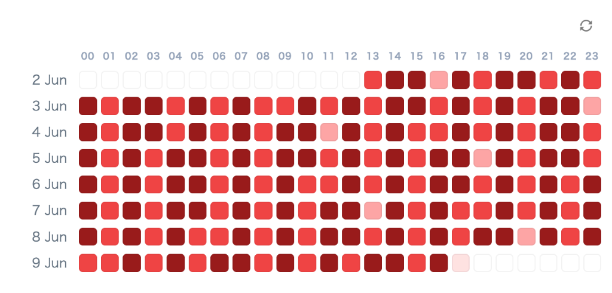
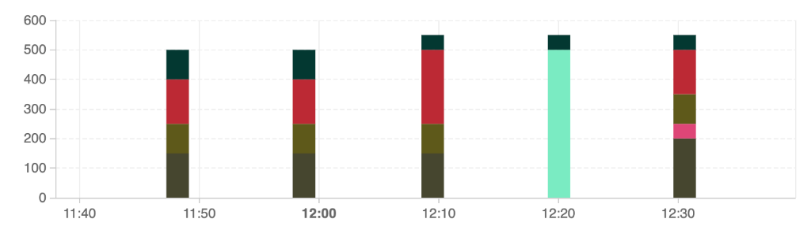
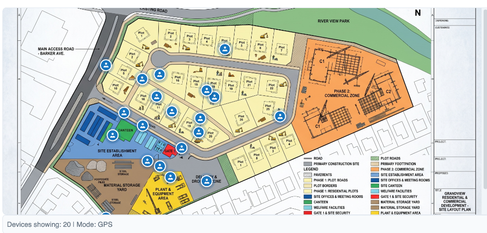
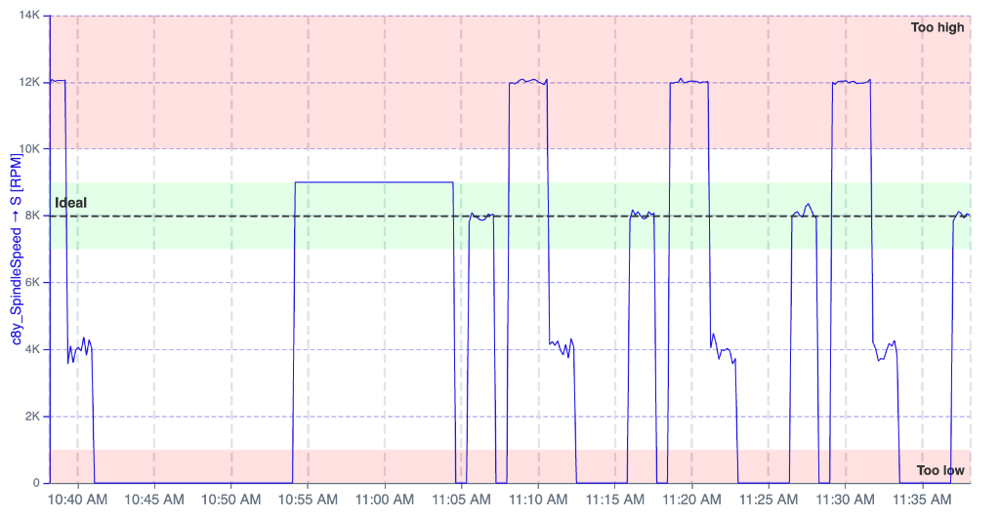
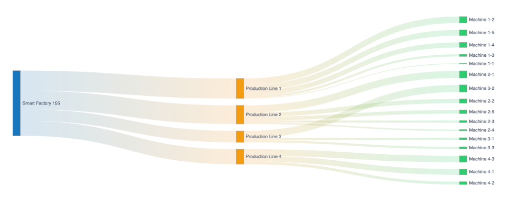
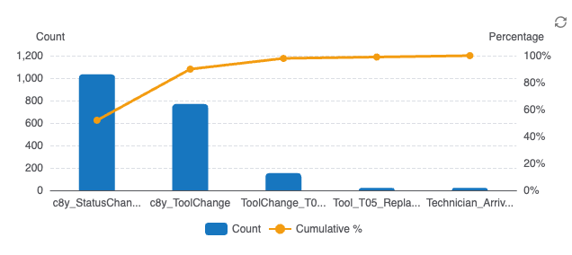
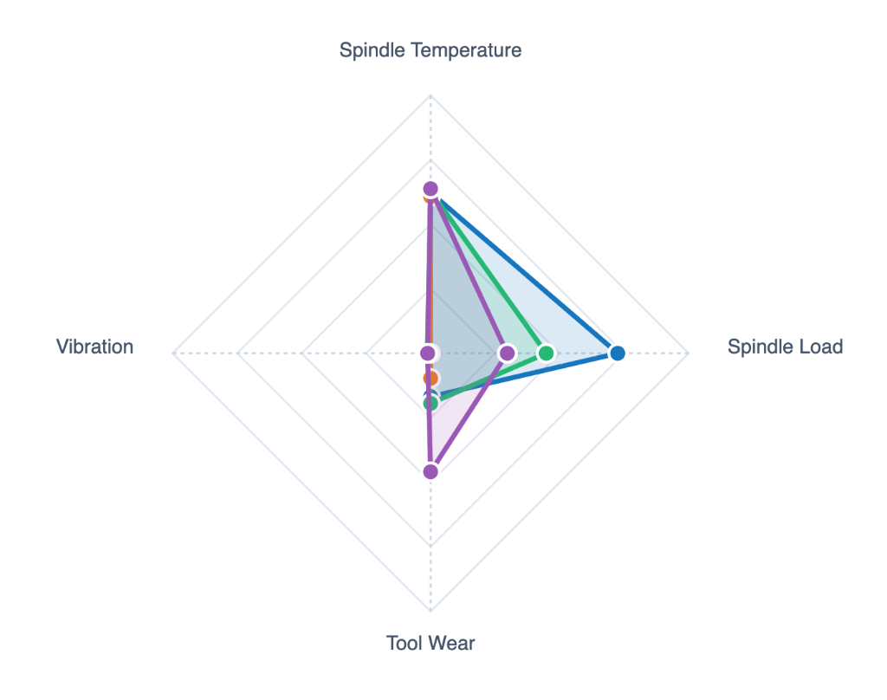

# Cumulocity Widget Library

A collection of custom dashboard widgets for the Cumulocity platform. This library provides advanced visualization capabilities to enhance your dashboards.

## Overview

The library contains the following custom widgets:

1. **Alarm Heatmap Widget**: Visualizes alarm frequency over time as a configurable grid heatmap, allowing you to easily spot peak periods of system alarms.
   
   

2. **Stacked Bar Chart Widget**: Displays a stacked bar chart with selected data points, useful for comparing multiple metrics across categories or time intervals.

   

3. **Custom Map Widget**: Displays a custom map with dynamic tracking markers using GPS or custom coordinates, allowing you to track assets in real time.

   

4. **SPC Chart Widget**: Statistical Process Control line chart with control limits and annotations to help monitor and control process performance.

   

5. **Sankey Diagram Widget**: Displays the breakdown flow of alarms/events down the asset/group hierarchy, illustrating flow pathways and volumes.

   

6. **Pareto Chart Widget**: Analyses alarms/events by type in a Pareto distribution, highlighting the most frequent occurrences.

   

7. **Radar Chart Widget**: Allows comparing up to 5 devices across up to 10 datapoints, rendering missing data points visually.

   

8. **Ideal State Deviation Widget**: Scores an asset from 0 to 100 based on deviation from configured target ranges using custom scoring profiles (Linear, Exponential, Sigmoidal) and grace zones.


## Installation

### Prerequisites
- Cumulocity Web SDK (compatible with v1023.82.4 or later)
- Node.js (v18 or v20 recommended)
- Angular CLI

> [!IMPORTANT]
> **Compatibility Note**: These widgets require Cumulocity Cockpit / Web SDK version **1023.0.0 or later**. Attempting to load them into older versions (such as v1022) will fail at runtime with loading/dependency errors (e.g., `TypeError: Cannot read properties of undefined (reading 'hasOwnProperty')` or `NG0200` dependency injection errors) due to missing runtime exports in the host platform.


### Installing the Plugin
To install this widget library as a plugin in your Cumulocity application:

1. Install the package dependencies in your project:
   ```bash
   npm install cumulocity-widget-library
   ```

2. Add the modules of the widgets you want to use to your application's `app.module.ts`:
   ```typescript
     import { AlarmHeatmapWidgetModule, StackedBarChartWidgetModule, CustomMapWidgetModule, SpcChartWidgetModule, SankeyDiagramWidgetModule, ParetoChartWidgetModule, RadarChartWidgetModule, IdealStateDeviationWidgetModule } from 'cumulocity-widget-library';

     @NgModule({
       imports: [
         // ... other imports
         AlarmHeatmapWidgetModule,
         StackedBarChartWidgetModule,
         CustomMapWidgetModule,
         SpcChartWidgetModule,
         SankeyDiagramWidgetModule,
         ParetoChartWidgetModule,
         RadarChartWidgetModule,
         IdealStateDeviationWidgetModule
       ]
     })
    export class AppModule {}
   ```

## Quick Start

### Running Locally
To start a local development server for testing the widgets:

1. Install dependencies:
   ```bash
   npm install
   ```

2. Start the development server:
   ```bash
   npm run start
   ```

3. Open your browser and navigate to `http://localhost:4200/`.

## Build

To compile the library and build the production-ready plugin package:

```bash
npm run build
```

The build artifacts will be stored in the `dist/` directory, ready to be uploaded to your Cumulocity administration application under the Ecosystem -> Applications tab.

## Contributing

We welcome contributions to this project! Please read [CONTRIBUTING.md](file:///Users/tobias/repos/cumulocity-widget-library/CONTRIBUTING.md) and sign the [CONTRIBUTOR-LICENSE-AGREEMENT.md](file:///Users/tobias/repos/cumulocity-widget-library/CONTRIBUTOR-LICENSE-AGREEMENT.md) before submitting a Pull Request.

These tools are provided as-is and without warranty or support. They do not constitute part of the Cumulocity product suite. Users are free to use, fork and modify them, subject to the license agreement.

For more information or help, please visit the [Cumulocity TechCommunity](https://community.cumulocity.com/).

